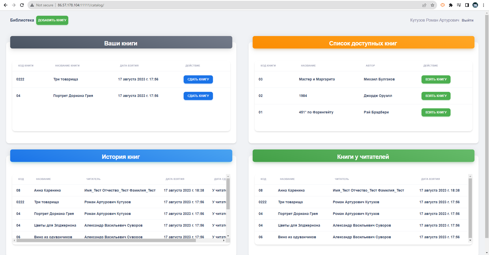

# Library 


Перейдите в браузере по адресу http://86.57.178.104:11111 для доступа к приложению "Библиотека".

Доступ к Административной части:

Перейдите http://86.57.178.104:11111/admin/. 
Войдите, используя логин admin и пароль test.


Сервис "Библиотека" - Описание и Руководство
Описание
Проект "Библиотека" представляет собой систему автоматизации учета выдачи книг читателям. Сервис позволяет удобно вести учет книг, читателей, а также контролировать процесс выдачи и возврата книг.

Функционал
Создание книг: 
- Книги могут быть созданы с указанием названия и автора. У каждого автора может быть несколько книг.

- Учет читателей: Читатели регистрируются в системе с указанием Фамилии, Имени и Отчества. Один читатель может быть зарегистрирован только один раз. Читатели могут одновременно иметь несколько книг.

- Учет выдачи книг: Система фиксирует дату выдачи и возврата книги читателю.

- Учет хранения книг: Пользователь может проверить остатки книг в библиотеке и узнать, какие книги находятся у читателей.

Используемые Технологии:

Backend: Python (Django)

Frontend: JavaScript, Bootstrap 5 (модальные окна)

База данных: SQLite (по умолчанию в Django)

Администрирование: Логин - admin, Пароль - test


## Запуск Приложения

To run tests, run the following command

```bash
 python3 -m venv env
```
```bash
 . env\scripts\activate
```
```bash
  pip install django
```
```bash
  git clone https://github.com/ramankutuzau/library.git
```
```bash
  python manage.py makemigrations
```
```bash
  python manage.py migrate
```
```bash
  python manage.py runserver
```
```bash
  http://127.0.0.1:8000
```


